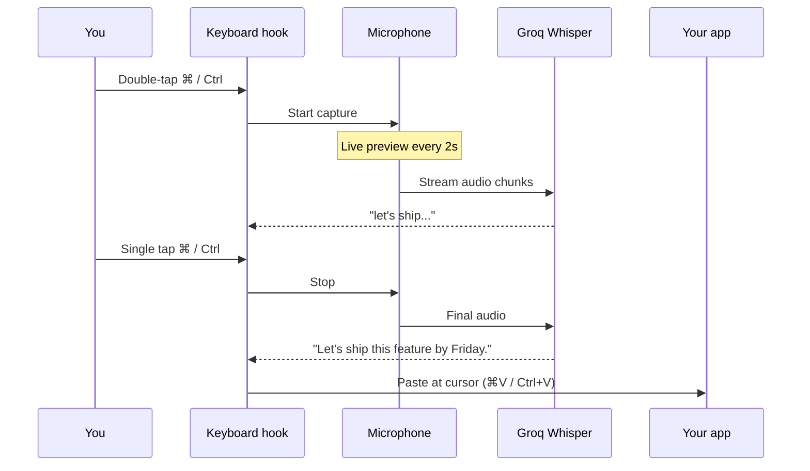
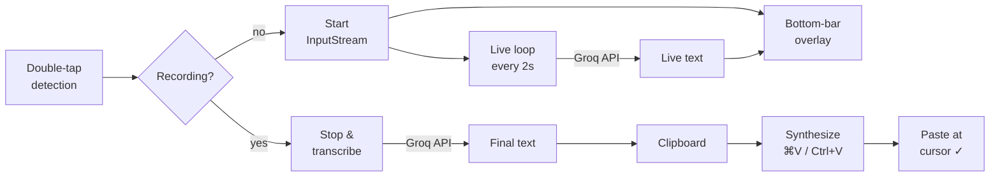

# STT — Speech to Text

> **Double-tap a key. Talk. Tap once. Your words appear.**

System-wide voice dictation for **macOS**, **Windows**, and **Linux**. No cloud lock-in — uses [Groq](https://console.groq.com/keys)'s free Whisper API (or fully offline MLX Whisper on Apple Silicon).

   

---

## How it feels

You're typing in any app. Hands on the keyboard.

```
  Step 1 — Double-tap ⌘ (or Ctrl on Win/Linux)
  ┌──────────────────────────────────────────────────────────────┐
  │                                                              │
  │                       Listening...                           │
  │                                                              │
  └──▬▬▬▬▬▬▬▬▬▬▬▬▬ soft green glow at the bottom ▬▬▬▬▬▬▬▬▬▬▬▬──┘

  Step 2 — Speak. Live text streams in as you talk.
  ┌──────────────────────────────────────────────────────────────┐
  │                                                              │
  │       "let's ship this feature by friday"  ...               │
  │                                                              │
  └──▬▬▬▬▬▬▬▬▬▬▬▬▬▬▬▬▬▬▬▬▬▬▬▬▬▬▬▬▬▬▬▬▬▬▬▬▬▬▬▬▬▬▬▬▬▬▬▬▬▬▬▬▬▬▬▬▬──┘

  Step 3 — Single-tap ⌘ (or Ctrl). Final text pastes at your cursor.
  ┌──────────────────────────────────────────────────────────────┐
  │                                                              │
  │     "Let's ship this feature by Friday."  ✓                  │
  │                                                              │
  └──────────────────── green flash ─────────────────────────────┘
```

---

## The flow



---

## Install

Pick your OS:

<table>
<tr>
<td width="33%" valign="top">

### 🍎 macOS

**Easiest — download .app:**

1. Grab [`STT-macOS.zip`](../../releases/latest) from releases
2. Unzip → drag `STT.app` to `/Applications`
3. Right-click → **Open** (bypasses unsigned warning)
4. Paste your [Groq API key](https://console.groq.com/keys)
5. Allow **Mic** + **Accessibility** in System Settings

**From source:**
```bash
git clone https://github.com/murataslan1/stt
cd stt/macos
./install.sh
python3 stt.py
```

</td>
<td width="33%" valign="top">

### 🪟 Windows

**From source:**
```cmd
git clone https://github.com/murataslan1/stt
cd stt\windows
pip install -r requirements.txt
python stt_windows.py
```

**Build standalone .exe:**
```cmd
build.bat
```
→ `dist\STT.exe` is self-contained. Double-click to run.

</td>
<td width="33%" valign="top">

### 🐧 Linux

```bash
git clone https://github.com/murataslan1/stt
cd stt/linux
./install.sh
python3 stt_linux.py
```

Handles apt / dnf / pacman automatically.

**X11 works out of the box.** Wayland: see caveats below.

</td>
</tr>
</table>

---

## Usage

| | macOS | Windows | Linux |
|---|:---:|:---:|:---:|
| **Start** recording | Double-tap `⌘` | Double-tap `Ctrl` | Double-tap `Ctrl` |
| **Stop** & paste | Single-tap `⌘` | Single-tap `Ctrl` | Single-tap `Ctrl` |

That's it. No menu, no clicks. Just the key.

The menu bar (macOS) lets you toggle between **Groq** (fast, cloud) and **Local** (offline MLX) mode or change your API key.

---

## API key

First launch shows this:

```
┌─────────────────────────────────────────┐
│  Welcome to STT                         │
│                                         │
│  Enter your Groq API key                │
│  (free at console.groq.com/keys)        │
│                                         │
│  ┌───────────────────────────────────┐  │
│  │ gsk_...                           │  │
│  └───────────────────────────────────┘  │
│                                         │
│           [ Save & Start ]              │
└─────────────────────────────────────────┘
```

Key is stored at `~/.config/stt/settings.json` (chmod 600 recommended). You can also set `GROQ_API_KEY` as an env var.

**Get a free key:** https://console.groq.com/keys (takes 30 seconds)

Skip the key? macOS falls back to local MLX Whisper (downloads ~1.5GB once, runs fully offline).

---

## Architecture



**Key files per platform:**

| Piece | macOS | Windows | Linux |
|---|---|---|---|
| Entry | [`macos/stt.py`](macos/stt.py) | [`windows/stt_windows.py`](windows/stt_windows.py) | [`linux/stt_linux.py`](linux/stt_linux.py) |
| Key hook | `NSEvent.addGlobalMonitor` | `pynput` | `pynput` (X11) |
| Overlay | AppKit `NSWindow` | Tkinter `Canvas` | Tkinter `Canvas` |
| Clipboard | `NSPasteboard` | `pyperclip` | `xclip` / `wl-copy` |
| Paste key | `Quartz.CGEvent` ⌘V | `pynput` Ctrl+V | `xdotool` / `wtype` |

---

## Tweaking

Open the entry file for your OS — config is at the top:

```python
DOUBLE_TAP_WINDOW = 0.4   # max seconds between taps
LIVE_INTERVAL = 2.0       # live transcription refresh
PREVIEW_LINGER = 3.0      # how long final text stays on screen
GROQ_MODEL = "whisper-large-v3-turbo"
```

**Different hotkey?** Change the key check in `handle_event` (macOS) or `_key_listener` (Win/Linux).

**Different STT engine?** Replace `transcribe_audio()` — takes a numpy float32 array, returns a string.

---

## Troubleshooting

<details>
<summary><b>macOS: nothing happens when I double-tap ⌘</b></summary>

Grant **Accessibility** permission:
System Settings → Privacy & Security → Accessibility → toggle on for `STT.app` (or Terminal if running from source).

Then restart the app.
</details>

<details>
<summary><b>macOS: "STT.app is damaged and can't be opened"</b></summary>

Gatekeeper is blocking the unsigned app. Run once:
```bash
xattr -dr com.apple.quarantine /Applications/STT.app
```
</details>

<details>
<summary><b>Linux Wayland: key hook doesn't fire</b></summary>

`pynput` can't grab global keys on most Wayland compositors by design. Options:

1. **Switch to X11 session** at login (GDM/SDDM session picker).
2. **Use a compositor shortcut** → bind `Super+Space` (or whatever) to `kill -USR1 $(pgrep -f stt_linux.py)` and patch the script to toggle on that signal.
3. **Run under Xorg** — most distros still ship an X session.

The *paste* side works fine on Wayland (uses `wl-copy` + `wtype` / `ydotool`).
</details>

<details>
<summary><b>Live transcription is blank / errors in logs</b></summary>

Probably an invalid Groq key. Menu bar → **Set Groq API Key...** (macOS), or edit `~/.config/stt/settings.json` directly.
</details>

<details>
<summary><b>Audio is too quiet / not picking up</b></summary>

Check default input device: macOS System Settings → Sound → Input; Windows Sound panel; Linux `pavucontrol`. `sounddevice` uses the system default.
</details>

---

## Privacy

- Audio streams to **Groq** only while you're recording. Nothing persists server-side (per Groq's privacy policy).
- Local MLX mode (macOS) keeps audio **on-device**. Zero network.
- Only your API key is stored on disk (`~/.config/stt/settings.json`).

---

## Project layout

```
stt/
├── macos/
│   ├── stt.py                    Main app (AppKit + MLX fallback)
│   ├── STT.app/                  Double-clickable wrapper
│   ├── install.sh
│   └── requirements.txt
├── windows/
│   ├── stt_windows.py            Main app (Tkinter + pynput)
│   ├── build.bat                 PyInstaller → standalone .exe
│   └── requirements.txt
└── linux/
    ├── stt_linux.py              Main app (Tkinter + pynput)
    ├── install.sh                apt / dnf / pacman auto-detect
    ├── stt.desktop               Menu entry
    └── requirements.txt
```

---

## License

[MIT](LICENSE) — do whatever, attribution appreciated.

Contributions welcome. If you build a Windows/Linux binary, open a PR or attach it to the release.
